**MOTOR CONTROL**

<table>
  <tr>
   <td>Solution
   </td>
   <td>Pros
   </td>
   <td>Cons
   </td>
  </tr>
  <tr>
   <td>

>>>>>  gd2md-html alert: inline image link here (to images/image1.png). Store image on your image server and adjust path/filename/extension if necessary.  (<a href="#">Back to top</a>)(<a href="#gdcalert2">Next alert</a>) >>>>> 

Option 1

Fairchild FAN 8100N

$1.16/ each

<em><a href="https://www.digikey.com/en/products/detail/rochester-electronics-llc/FAN8100N/11558200">Link to product</a> </em>
   </td>
   <td>
<ul>

<li>Fairly cheap</li>

<li>Already given from the class</li>

<li>DIP that is easy to mount to a PCB</li>

<li>Contains heat sinks</li>
</ul>
   </td>
   <td>
<ul>

<li>Fairly narrow operating voltage</li>

<li>Expensive shipping rates</li>
</ul>
   </td>
  </tr>
</table>

<table>
  <tr>
   <td>Solution
   </td>
   <td>Pros
   </td>
   <td>Cons
   </td>
  </tr>
  <tr>
   <td>

>>>>>  gd2md-html alert: inline image link here (to images/image2.png). Store image on your image server and adjust path/filename/extension if necessary.  (<a href="#">Back to top</a>)(<a href="#gdcalert3">Next alert</a>) >>>>> 

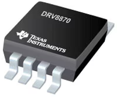

Option 2

DRV8411 Dual H-Bridge Motor Driver

$2.30/ each

<em><a href="https://www.digikey.com/en/products/detail/texas-instruments/DRV8411ARTER/18115551">Link to product</a> </em>
   </td>
   <td>
<ul>

<li>Can be used for 1 or 2 motors</li>

<li>Wide range of operational voltages</li>
</ul>
   </td>
   <td>
<ul>

<li>More expensive</li>

<li>Slow shipping time</li>

<li>Requires a different setup on a PCB</li>
</ul>
   </td>
  </tr>
</table>

<table>
  <tr>
   <td>Solution
   </td>
   <td>Pros
   </td>
   <td>Cons
   </td>
  </tr>
  <tr>
   <td>

>>>>>  gd2md-html alert: inline image link here (to images/image3.png). Store image on your image server and adjust path/filename/extension if necessary.  (<a href="#">Back to top</a>)(<a href="#gdcalert4">Next alert</a>) >>>>> 

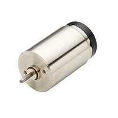

Option 3

DRV8870 Brushed-DC Motor Driver

$2.09/ each

<em><a href="https://www.digikey.com/en/products/detail/texas-instruments/DRV8870DDAR/5455925">Link to product</a> </em>
   </td>
   <td>
<ul>

<li>Fairly small</li>

<li>Wide voltage operating range</li>
</ul>
   </td>
   <td>
<ul>

<li>Only operates one motor</li>

<li>Requires different PCB layout</li>

<li>Operating range lies outside of amount supplied by voltage regulator</li>
</ul>
   </td>
  </tr>
</table>

**Choice**: Option 1: Fairchild FAN 8100N

**Rationale**: The FAN8100N is already accessible to the team through the materials given throughout the year, saving on shipping costs, time, and the cost of the unit itself. Additionally, the H-bridge will easily slot into PCBs, and contains heat sinks to keep the part safe and minimize damage and potential replacement.

**MOTOR**

<table>
  <tr>
   <td>Solution
   </td>
   <td>Pros
   </td>
   <td>Cons
   </td>
  </tr>
  <tr>
   <td>

>>>>>  gd2md-html alert: inline image link here (to images/image4.png). Store image on your image server and adjust path/filename/extension if necessary.  (<a href="#">Back to top</a>)(<a href="#gdcalert5">Next alert</a>) >>>>> 

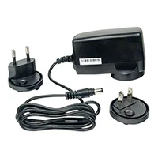

Option 1

Pololu 3483 Metal Gearmotor

$35.95/ each

<em><a href="https://www.digikey.com/en/products/detail/pololu/3483/10450159">Link to product</a> </em>
   </td>
   <td>
<ul>

<li>Able to provide good torque</li>

<li>Good RPM</li>

<li>Falls within operating necessities</li>
</ul>
   </td>
   <td>
<ul>

<li>Heavy</li>

<li>Somewhat expensive</li>
</ul>
   </td>
  </tr>
</table>

<table>
  <tr>
   <td>Solution
   </td>
   <td>Pros
   </td>
   <td>Cons
   </td>
  </tr>
  <tr>
   <td>

>>>>>  gd2md-html alert: inline image link here (to images/image5.png). Store image on your image server and adjust path/filename/extension if necessary.  (<a href="#">Back to top</a>)(<a href="#gdcalert6">Next alert</a>) >>>>> 

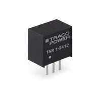

Option 2

STANDARD MOTOR 6600 RPM 12V

$2.75/ each

<em><a href="https://www.digikey.com/en/products/detail/sparkfun-electronics/11696/6163657">Link to product</a> </em>
   </td>
   <td>
<ul>

<li>Very cheap</li>

<li>High RPM</li>
</ul>
   </td>
   <td>
<ul>

<li>Low Strength</li>

<li>Ideal Voltage is lower than 12V</li>
</ul>
   </td>
  </tr>
</table>

<table>
  <tr>
   <td>Solution
   </td>
   <td>Pros
   </td>
   <td>Cons
   </td>
  </tr>
  <tr>
   <td>

>>>>>  gd2md-html alert: inline image link here (to images/image6.png). Store image on your image server and adjust path/filename/extension if necessary.  (<a href="#">Back to top</a>)(<a href="#gdcalert7">Next alert</a>) >>>>> 

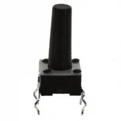

Option 3

Portescap 17N78210E.1 Brushed DC Motor

$141.02/ each

<em><a href="https://www.digikey.com/en/products/detail/portescap/17N78210E-1/5032382">Link to product</a> </em>
   </td>
   <td>
<ul>

<li>High RPM</li>

<li>Lightweight</li>

<li>Good Torque</li>
</ul>
   </td>
   <td>
<ul>

<li>Very expensive</li>

<li>Somewhat large</li>
</ul>
   </td>
  </tr>
</table>

**Choice**: Option 1: Pololu 4754 Metal Gearmotor

**Rationale**: The Pololu 4754 has the best features for the price. While the Portescap 17N78210E.1 likely outclasses it in terms of features, the significantly higher price is too much. Conversely, although option 2 is much less expensive, it likely will not be able to handle the necessary operations to complete the project.

**Voltage Regulator**

<table>
  <tr>
   <td>Solution
   </td>
   <td>Pros
   </td>
   <td>Cons
   </td>
  </tr>
  <tr>
   <td>

>>>>>  gd2md-html alert: inline image link here (to images/image7.png). Store image on your image server and adjust path/filename/extension if necessary.  (<a href="#">Back to top</a>)(<a href="#gdcalert8">Next alert</a>) >>>>> 

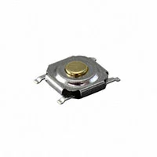

Option 1

Taejin LM7805T

$0.33/ each

<em><a href="https://www.digikey.com/en/products/detail/taejin/LM7805T/22237260">Link to product</a> </em>
   </td>
   <td>
<ul>

<li>The team already has these </li>

<li>The team already has experience with them</li>

<li>Good input voltage range</li>
</ul>
   </td>
   <td>
<ul>

<li>Can only be bought in quantities of 100</li>

<li>Very high shipping costs</li>
</ul>
   </td>
  </tr>
</table>

<table>
  <tr>
   <td>Solution
   </td>
   <td>Pros
   </td>
   <td>Cons
   </td>
  </tr>
  <tr>
   <td>

>>>>>  gd2md-html alert: inline image link here (to images/image8.png). Store image on your image server and adjust path/filename/extension if necessary.  (<a href="#">Back to top</a>)(<a href="#gdcalert9">Next alert</a>) >>>>> 

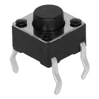

Option 2

L7805CV

$0.50/ each

<em><a href="https://www.digikey.com/en/products/detail/stmicroelectronics/L7805CV/585964">Link to product</a> </em>
   </td>
   <td>
<ul>

<li>Very similar to the component we are familiar with</li>

<li>Dynamic pricing making it cheaper at high quantities than other options</li>

<li>Multiple options to regulate voltage to</li>
</ul>
   </td>
   <td>
<ul>

<li>Higher cost for fewer ICs, especially with the amount we would need.</li>

<li></li>
</ul>
   </td>
  </tr>
</table>

<table>
  <tr>
   <td>Solution
   </td>
   <td>Pros
   </td>
   <td>Cons
   </td>
  </tr>
  <tr>
   <td>

>>>>>  gd2md-html alert: inline image link here (to images/image9.png). Store image on your image server and adjust path/filename/extension if necessary.  (<a href="#">Back to top</a>)(<a href="#gdcalert10">Next alert</a>) >>>>> 

Option 3

TSR 1-2450E

$3.40/ each

<em><a href="https://www.digikey.com/en/products/detail/traco-power/TSR-1-2450E/12171283?gclsrc=aw.ds&gad_source=1&gad_campaignid=20514529159&gbraid=0AAAAADrbLlgWGBlWjflyHhRiGaLYv3Epu&gclid=CjwKCAjwjffHBhBuEiwAKMb8pD-mqqOCOsPZwvH_wFIX80YuV_EtZSpPDIO-yR5d0faT6Zg0MA_hdBoCtrwQAvD_BwE">Link to product</a> </em>
   </td>
   <td>
<ul>

<li>High input voltage range</li>

<li>Able to regulate down to 3.3 or 5v</li>
</ul>
   </td>
   <td>
<ul>

<li>Most expensive</li>

<li>Uses an unfamiliar setup</li>
</ul>
   </td>
  </tr>
</table>

**Choice**: Option 1: Taejin LM7805T

**Rationale**: This product is the easiest to design the project with, since the team has access and experience with it already. However, in the event of needing to change parts or get replacements, the L7805CV may be a better option. Until those replacements are needed, however, the LM7805T remains the best option.

**Pushbutton**

<table>
  <tr>
   <td>Solution
   </td>
   <td>Pros
   </td>
   <td>Cons
   </td>
  </tr>
  <tr>
   <td>

>>>>>  gd2md-html alert: inline image link here (to images/image10.png). Store image on your image server and adjust path/filename/extension if necessary.  (<a href="#">Back to top</a>)(<a href="#gdcalert11">Next alert</a>) >>>>> 

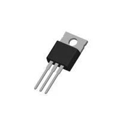

Option 1

TS02-66-43-BK-260-LCR-D

$0.10/ each

<em><a href="https://www.digikey.com/en/products/detail/same-sky-formerly-cui-devices-/TS02-66-43-BK-260-LCR-D/15634346?gclsrc=aw.ds&gad_source=1&gad_campaignid=20243136172&gbraid=0AAAAADrbLlhl1FW1Wjj4ieek0F8WLsTTK&gclid=CjwKCAjwjffHBhBuEiwAKMb8pLnWc03-gP3PWjbd43iN3Hi-nOv00Bcr7raPPPTGUZCc2KiJV5ae-xoCMFgQAvD_BwE">Link to product</a> </em>
   </td>
   <td>
<ul>

<li>The team is already familiar with this product</li>

<li>The team already has this product</li>

<li>The button is able to be placed flexibly due to its size.</li>

<li>Quite cheap</li>
</ul>
   </td>
   <td>
<ul>

<li>The button must be positioned well, due to its small dimensions</li>
</ul>
   </td>
  </tr>
</table>

<table>
  <tr>
   <td>Solution
   </td>
   <td>Pros
   </td>
   <td>Cons
   </td>
  </tr>
  <tr>
   <td>

>>>>>  gd2md-html alert: inline image link here (to images/image11.png). Store image on your image server and adjust path/filename/extension if necessary.  (<a href="#">Back to top</a>)(<a href="#gdcalert12">Next alert</a>) >>>>> 

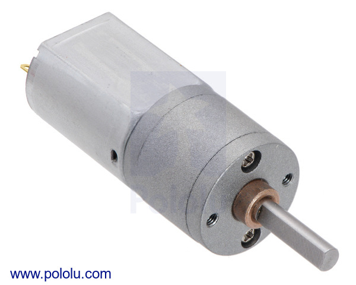

Option 2

SWITCH TACTILE SPST-NO 0.05A 24V

$0.14/ each

<em><a href="https://www.digikey.com/en/products/detail/te-connectivity-alcoswitch-switches/2-1825910-7/1632528">Link to product</a> </em>
   </td>
   <td>
<ul>

<li>Has a high voltage capacity</li>

<li>Similar setup to the button the team is familiar with</li>
</ul>
   </td>
   <td>
<ul>

<li>The large profile of the button makes it harder to place</li>
</ul>
   </td>
  </tr>
</table>

<table>
  <tr>
   <td>Solution
   </td>
   <td>Pros
   </td>
   <td>Cons
   </td>
  </tr>
  <tr>
   <td>

>>>>>  gd2md-html alert: inline image link here (to images/image12.png). Store image on your image server and adjust path/filename/extension if necessary.  (<a href="#">Back to top</a>)(<a href="#gdcalert13">Next alert</a>) >>>>> 

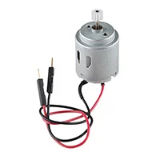

Option 3

CKN12221-1-ND

$0.14/ each

<em><a href="https://www.digikey.com/en/products/detail/c-k/PTS526SK15SMTR2-LFS/10056626">Link to product</a> </em>
   </td>
   <td>
<ul>

<li>The flush button makes it easier to put on the finished product</li>

<li>The price decreases as more are bought, so it is good for bulk purchases</li>
</ul>
   </td>
   <td>
<ul>

<li>The button is unlike the one the team is familiar with</li>
</ul>
   </td>
  </tr>
</table>

**Choice**: Option 1: TS02-66-43-BK-260-LCR-D

**Rationale**: Since this button is the most familiar, and the size is fairly small, it will likely be the best, saving on the time and money needed to purchase and ship it, while also being small enough to be placed flexibly on the finished product

**Primary power supply**

<table>
  <tr>
   <td>Solution
   </td>
   <td>Pros
   </td>
   <td>Cons
   </td>
  </tr>
  <tr>
   <td>

>>>>>  gd2md-html alert: inline image link here (to images/image13.png). Store image on your image server and adjust path/filename/extension if necessary.  (<a href="#">Back to top</a>)(<a href="#gdcalert14">Next alert</a>) >>>>> 

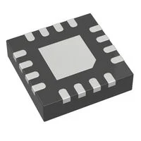

Option 1

ALITOVE 12V 5A

$12.99/ each

<em><a href="https://alitove.com/products/alitove-dc-12v-5a-power-supply?_pos=3&_psq=12v&_ss=e&_v=1.0">Link to product</a> </em>
   </td>
   <td>
<ul>

<li>The power supply fits into a wall outlet</li>

<li>The DC power jack fits with the other parts the team has used well.</li>

<li>The addition of another power head can allow the team to be more flexible after designing</li>
</ul>
   </td>
   <td>
<ul>

<li>5A does not quite reach the stall current of the motor</li>

<li>It may be more bulky than necessary for our product.</li>
</ul>
   </td>
  </tr>
</table>

<table>
  <tr>
   <td>Solution
   </td>
   <td>Pros
   </td>
   <td>Cons
   </td>
  </tr>
  <tr>
   <td>

>>>>>  gd2md-html alert: inline image link here (to images/image14.png). Store image on your image server and adjust path/filename/extension if necessary.  (<a href="#">Back to top</a>)(<a href="#gdcalert15">Next alert</a>) >>>>> 

Option 2

1286-1213-ND

$19.99/ each

<em><a href="https://www.digikey.com/en/products/detail/digilent-inc/240-057/9445917">Link to product</a> </em>
   </td>
   <td>
<ul>

<li>The power supply fits into a wall outlet</li>

<li>The DC power jack fits with the other parts the team has used well.</li>
</ul>
   </td>
   <td>
<ul>

<li>Expensive compared to other options</li>
</ul>
   </td>
  </tr>
</table>

<table>
  <tr>
   <td>Solution
   </td>
   <td>Pros
   </td>
   <td>Cons
   </td>
  </tr>
  <tr>
   <td>

>>>>>  gd2md-html alert: inline image link here (to images/image15.png). Store image on your image server and adjust path/filename/extension if necessary.  (<a href="#">Back to top</a>)(<a href="#gdcalert16">Next alert</a>) >>>>> 

Option 3

MEAN WELL USA AC/DC CONVERTER 12V 36W

$13.30/ each

<em><a href="https://www.digikey.com/en/products/detail/mean-well-usa-inc/RS-35-12/7706181">Link to product</a> </em>
   </td>
   <td>
<ul>

<li>A fairly cheap option</li>

<li>Very powerful</li>
</ul>
   </td>
   <td>
<ul>

<li>It may be too powerful for the motor we are planning to use.</li>

<li>It will be difficult to connect and is unlike the others used by the team</li>
</ul>
   </td>
  </tr>
</table>

**Choice**: Option 1: ALITOVE 12V 5A

**Rationale**: The DC power jack connector and the ability to switch the connection type is the most useful, combined with being the cheapest option out of the potential choices. Additionally, the Amperage should be fine, as the motor should never stall in its intended application.
