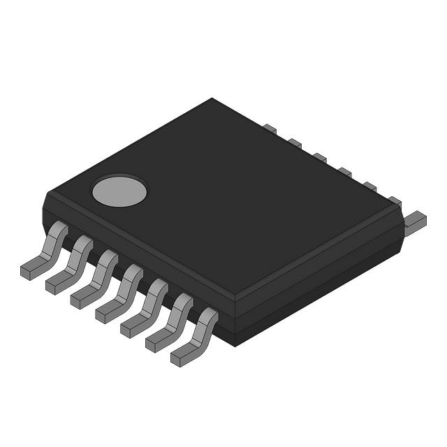
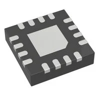
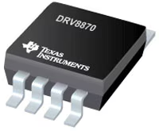
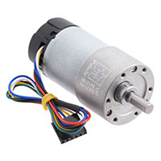
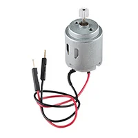
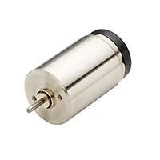

**MOTOR CONTROL**

<table>
<colgroup>
<col style="width: 33%" />
<col style="width: 33%" />
<col style="width: 33%" />
</colgroup>
<thead>
<tr>
<th style="text-align: left;">Solution</th>
<th style="text-align: left;">Pros</th>
<th style="text-align: left;">Cons</th>
</tr>
<tr>
<th style="text-align: left;">

Option 1

Fairchild FAN 8100N

$1.16/ each

<em><a
href="https://www.digikey.com/en/products/detail/rochester-electronics-llc/FAN8100N/11558200"><u>Link
to product</u></a></em>
</th>
<th><ul>
<li>
Fairly cheap
</li>
<li>
Already given from the class
</li>
<li>
DIP that is easy to mount to a PCB
</li>
<li>
Contains heat sinks
</li>
</ul></th>
<th><ul>
<li>
Fairly narrow operating voltage
</li>
<li>
Expensive shipping rates
</li>
</ul></th>
</tr>
</thead>
<tbody>
</tbody>
</table>

<table>
<colgroup>
<col style="width: 33%" />
<col style="width: 33%" />
<col style="width: 33%" />
</colgroup>
<thead>
<tr>
<th>Solution</th>
<th>Pros</th>
<th>Cons</th>
</tr>
<tr>
<th>

Option 2

DRV8411 Dual H-Bridge Motor Driver

$2.30/ each

<em><a
href="https://www.digikey.com/en/products/detail/texas-instruments/DRV8411ARTER/18115551"><u>Link
to product</u></a></em>
</th>
<th><ul>
<li>
Can be used for 1 or 2 motors
</li>
<li>
Wide range of operational voltages
</li>
</ul></th>
<th><ul>
<li>
More expensive
</li>
<li>
Slow shipping time
</li>
<li>
Requires a different setup on a PCB
</li>
</ul></th>
</tr>
</thead>
<tbody>
</tbody>
</table>

<table>
<colgroup>
<col style="width: 33%" />
<col style="width: 33%" />
<col style="width: 33%" />
</colgroup>
<thead>
<tr>
<th>Solution</th>
<th>Pros</th>
<th>Cons</th>
</tr>
<tr>
<th>

Option 3

DRV8870 Brushed-DC Motor Driver

$2.09/ each

<em><a
href="https://www.digikey.com/en/products/detail/texas-instruments/DRV8870DDAR/5455925"><u>Link
to product</u></a></em>
</th>
<th><ul>
<li>
Fairly small
</li>
<li>
Wide voltage operating range
</li>
</ul></th>
<th><ul>
<li>
Only operates one motor
</li>
<li>
Requires different PCB layout
</li>
<li>
Operating range lies outside of amount supplied by voltage
regulator
</li>
</ul></th>
</tr>
</thead>
<tbody>
</tbody>
</table>

**Choice**: Option 1: Fairchild FAN 8100N

**Rationale**: The FAN8100N is already accessible to the team through
the materials given throughout the year, saving on shipping costs, time,
and the cost of the unit itself. Additionally, the H-bridge will easily
slot into PCBs, and contains heat sinks to keep the part safe and
minimize damage and potential replacement.

**MOTOR**

<table>
<colgroup>
<col style="width: 33%" />
<col style="width: 33%" />
<col style="width: 33%" />
</colgroup>
<thead>
<tr>
<th>Solution</th>
<th>Pros</th>
<th>Cons</th>
</tr>
<tr>
<th>

Option 1

Pololu 4754 Metal Gearmotor

$44.95/ each

<em><a
href="https://www.digikey.com/en/products/detail/pololu/4754/10450208"><u>Link
to product</u></a></em>
</th>
<th><ul>
<li>
Able to provide good torque
</li>
<li>
Good RPM
</li>
</ul></th>
<th><ul>
<li>
Heavy
</li>
<li>
Fairly expensive
</li>
</ul></th>
</tr>
</thead>
<tbody>
</tbody>
</table>

<table>
<colgroup>
<col style="width: 33%" />
<col style="width: 33%" />
<col style="width: 33%" />
</colgroup>
<thead>
<tr>
<th>Solution</th>
<th>Pros</th>
<th>Cons</th>
</tr>
<tr>
<th>

Option 2

STANDARD MOTOR 6600 RPM 12V

$2.75/ each

<em><a
href="https://www.digikey.com/en/products/detail/sparkfun-electronics/11696/6163657"><u>Link
to product</u></a></em>
</th>
<th><ul>
<li>
Very cheap
</li>
<li>
High RPM
</li>
</ul></th>
<th><ul>
<li>
Low Strength
</li>
<li>
Ideal Voltage is lower than 12V
</li>
</ul></th>
</tr>
</thead>
<tbody>
</tbody>
</table>

<table>
<colgroup>
<col style="width: 33%" />
<col style="width: 33%" />
<col style="width: 33%" />
</colgroup>
<thead>
<tr>
<th>Solution</th>
<th>Pros</th>
<th>Cons</th>
</tr>
<tr>
<th>

Option 3

Portescap 17N78210E.1 Brushed DC Motor

$141.02/ each

<em><a
href="https://www.digikey.com/en/products/detail/portescap/17N78210E-1/5032382"><u>Link
to product</u></a></em>
</th>
<th><ul>
<li>
High RPM
</li>
<li>
Lightweight
</li>
<li>
Good Torque
</li>
</ul></th>
<th><ul>
<li>
Very expensive
</li>
<li>
Somewhat large
</li>
</ul></th>
</tr>
</thead>
<tbody>
</tbody>
</table>

**Choice**: Option 1: Pololu 4754 Metal Gearmotor

**Rationale**: The Pololu 4754 has the best features for the price.
While the Portescap 17N78210E.1 likely outclasses it in terms of
features, the significantly higher price is too much. Conversely,
although option 2 is much less expensive, it likely will not be able to
handle the necessary operations to complete the project.
